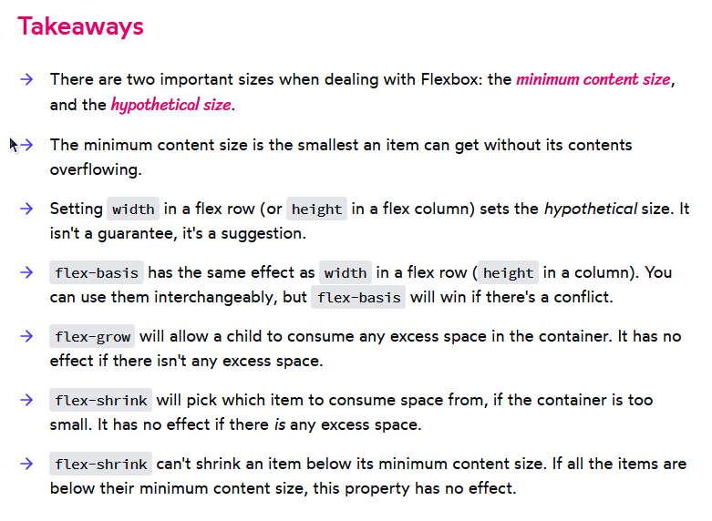
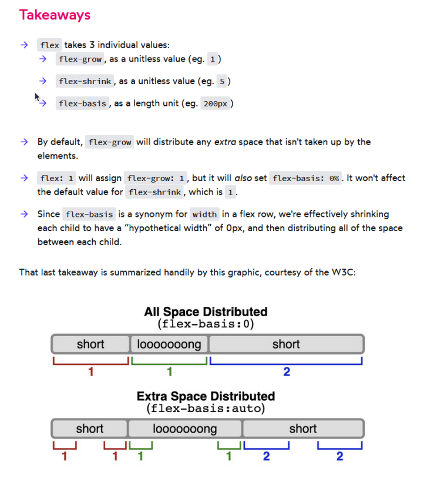
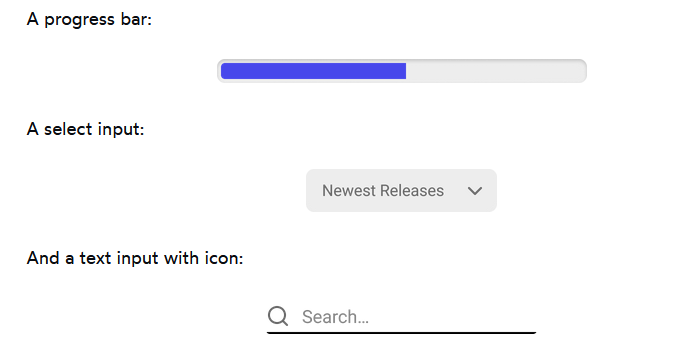

# webdev-learning-materials
A list of learning materials for Web Development.

## TABLE OF CONTENTS
  * [Learning to Learn](#learning-to-learn)
    + [Free](#free)
    + [Paid](#paid)
  * [HTML](#html)
    + [Free](#free-1)
  * [CSS](#css)
    + [Free](#free-2)
    + [Paid](#paid-1)
    + [Additional content](#additional-content)
  * [Git](#git)
    + [Free](#free-3)
    + [Additional content](#additional-content-1)
  * [JavaScript](#javascript)
    + [Free](#free-4)
    + [Paid](#paid-2)
    + [Additional content](#additional-content-2)
  * [TypeScript](#typescript)
    + [Free](#free-5)
    + [Paid](#paid-3)
    + [Additional content](#additional-content-3)
  * [Clean Code](#clean-code)
    + [Free](#free-6)
    + [Paid](#paid-4)
    + [Additional content](#additional-content-4)
  * [Design Patterns](#design-patterns)
    + [Free](#free-7)
    + [Paid](#paid-5)
    + [Additional content](#additional-content-5)
  * [Node.js](#nodejs)
    + [Free](#free-8)
    + [Paid](#paid-6)
    + [Additional content](#additional-content-6)
  * [React](#react)
    + [Free](#free-9)
    + [Paid](#paid-7)
    + [Additional content](#additional-content-7)
  * [HR/Recruitment Resources](#hr--recruitment-resources)
  * [Job Boards (find your dream job)](#job-boards-find-your-dream-job)
  * [Other Resources (worth your time)](#other-resources-worth-your-time)
    + [Valuable videos](#valuable-videos)
    * [Turn your theory into practice](#turn-your-theory-into-practice)
      + [Test your skills](#test-your-skills)
      + [Interesting tutorials to get you inspired](#interesting-tutorials-to-get-you-inspired)
      + [Build your own project (better than cloning, ideally make it as a group project!):](#build-your-own-project-better-than-cloning-ideally-make-it-as-a-group-project)
  * [Productivity tools](#productivity-tools)
  * [Contributing](#contributing)

## YouTube Channels / Blogs
- [Fireship](https://www.youtube.com/c/Fireship)
- [uidotdev (JS/React)](https://www.youtube.com/c/uidotdev/)
- [Kevin Powell (HTML/CSS/JS)](https://www.youtube.com/kepowob)
- [Kent C. Dodds (JS/React)](https://kentcdodds.com/blog)
- [Josh W. Comeau (CSS/JS)](https://www.joshwcomeau.com/)
- [Matt Pocock (TypeScript)](https://www.youtube.com/channel/UCswG6FSbgZjbWtdf_hMLaow)
- [DesignCode (Figma/React)](https://www.youtube.com/c/DesignCodeTeam)
- [Web Dev Junkie (JS/React)](https://www.youtube.com/c/WebDevJunkie)
- [Jack Herrington (JS/React)](https://www.youtube.com/c/JackHerrington)
- [TomDoesTech (JS/React)](https://www.youtube.com/c/TomDoesTech)
- [Oak Harbor Web Designs (builds real-world HTML/CSS/JS websites)](https://www.youtube.com/channel/UC6YEjppZo4Ep-8N54_nXFQg)
- 🇵🇱 [Jak zacząć programować? (HTML/CSS/JS)](https://www.youtube.com/c/Jakzacz%C4%85%C4%87programowa%C4%87)
- 🇵🇱 [Przeprogramowani (JavaScript i nie tylko)](https://www.youtube.com/c/Przeprogramowani)


## Learning to Learn

### Free
- [The Growth Mindset](https://www.youtube.com/watch?v=-71zdXCMU6A)
- [Khan Academy - High school activities: Growth mindset](https://www.khanacademy.org/college-careers-more/learnstorm-growth-mindset-activities-us/high-school-activities/activity-1-the-truth-about-your-brain-hs-02/a/the-truth-about-your-brain-part-1-3?modal=1)
- ["Your Theme"](https://www.youtube.com/watch?v=NVGuFdX5guE)
- [Josh W. Comeau - How to learn stuff quickly](https://www.joshwcomeau.com/blog/how-to-learn-stuff-quickly/)
- [An Approach to Continuous Learning](https://dev.to/abh1navv/an-approach-to-continuous-learning-30pk)
- [Reddit Post - Most of you need to SLOW DOWN](https://www.reddit.com/r/learnprogramming/comments/vvsw0x/most_of_you_need_to_slow_down/)

### Paid
- [Zero to Mastery - Learning to Learn](https://academy.zerotomastery.io/p/learning-to-learn-efficient-learning-zero-to-mastery-blueprint)

## HTML

### Free
- [Codecademy - Learn HTML](https://www.codecademy.com/learn/learn-html)
- [Minim - HTML for Absolute Beginners](https://www.youtube.com/playlist?list=PL4cTxE4s2XIYJL6uPQUwMt25M70gPl-O6)
- 🇵🇱 [Jak zacząć programować? - Podstawy HTML + CSS w dwie godziny - kurs krok po kroku!](https://www.youtube.com/watch?v=opNgrPv3Qw8)

### Additional content
- [Minim - When to Use Semantic HTML Elements Instead of Divs (part of the HTML for Absolute Beginners series)](https://www.youtube.com/watch?v=ZThq93Yuwd0)
- [Web Dev Simplified - 5+ Must Know HTML Tags That Almost Nobody Knows](https://www.youtube.com/watch?v=iX_QyjdctsQ)
- [HTML Reference](https://htmlreference.io/)
- [Bartosz Zagrodzki - Do you know all input types?](https://www.zagrodzki.me/blog/do-you-know-all-input-types)

## CSS

### Free
- [Codecademy - Learn CSS](https://www.codecademy.com/learn/learn-css)
- [Codecademy - Intermediate CSS](https://www.codecademy.com/learn/learn-intermediate-css)
- [web.dev - Learn CSS](https://web.dev/learn/css/)

### Paid
- [CSS for JavaScript Developers](https://css-for-js.dev/)

### Additional content
- [Josh W. Comeau - The Surprising Truth About Pixels and Accessibility](https://www.joshwcomeau.com/css/surprising-truth-about-pixels-and-accessibility)
- [Josh W. Comeau - Secret Mechanisms of CSS [learn the "hidden" fundamentals that nobody told you about.]](https://www.youtube.com/watch?v=Xt1Cw4qM3Ec)
- [Fireship - 10 CSS Pro Tips - Code this, NOT that!](https://youtu.be/Qhaz36TZG5Y)
- [Fireship - 3 More Life-Changing CSS Tips](https://www.youtube.com/watch?v=JSURzPQnkl0)
- [Defensive CSS - practical tips that helps in building "bullet-proof" UI interfaces](https://defensivecss.dev/)
- [CSS Reference - visual guide for the most popular properties](https://cssreference.io/)
- [Kevin Powell - The console.log() of CSS](https://www.youtube.com/shorts/ii-lSK2_Nu4)
- [Josh W. Comeau - What The Heck, z-index?? [how to manage the positioning of elements]](https://www.joshwcomeau.com/css/stacking-contexts/)
- [CSS Tricks - My Dumbest CSS Mistakes](https://css-tricks.com/my-dumbest-css-mistakes/)
- [Josh W. Comeau - You Don’t Need A UI Framework (how to build ui without using the third-party component library?)](https://www.smashingmagazine.com/2022/05/you-dont-need-ui-framework/)

<details>
<summary>Takeaways from CSS for JavaScript Developers:</summary>

- Flex Basis / Flex Grow / Flex Shrink

- Flex Shorthand


</details>


## Git

### Free
- [BitBucket - Learn Git](https://www.atlassian.com/git/tutorials)
- 🇵🇱 [Overment - Kurs Git po polsku od podstaw](https://www.youtube.com/playlist?list=PLjHmWifVUNMKIGHmaGPVqSD-L6i1Zw-MH)

### Additional content
- [List of git commands for different situations](https://ohshitgit.com/)
- [Fireship - 13 Advanced (but useful) Git Techniques and Shortcuts](https://www.youtube.com/watch?v=ecK3EnyGD8o)
- [Annie Sexton - Git Organized: A Better Git Flow](https://dev.to/render/git-organized-a-better-git-flow-56go)
- [How to learn Git slowly.](https://dev.to/samuelfaure/how-to-learn-git-slowly-38fa)
- [Write Git Commit Messages That Your Colleagues Will Love](https://dev.to/simeg/write-git-commit-messages-that-your-colleagues-will-love-1757)
- [Conventional Commits - add a type of your commit to your messages](https://www.conventionalcommits.org/en/v1.0.0/)
- [Undo wrong Git changes](https://dev.to/dailydevtips1/undo-wrong-git-changes-32mc)
- [Please Start Writing Better Git Commits](https://tawdev.hashnode.dev/please-start-writing-better-git-commits)
- 🇵🇱 [Conventional Commits czyli jak tworzyć epickie commity w git](https://highlab.pl/conventional-commits/)

## JavaScript

### Free
- [Academind - JavaScript Course for Beginners - Learn JavaScript from Scratch!](https://www.youtube.com/watch?v=2qDywOS7VAc)
- [Codecademy - Learn JavaScript](https://www.codecademy.com/learn/introduction-to-javascript)
- [Codecademy - Intermediate JavaScript](https://www.codecademy.com/learn/learn-intermediate-javascript)
- [Exercism - Learn JavaScript by doing exercises](https://exercism.org/tracks/javascript)
- 🇵🇱 [Jak zacząć programować? - Kurs JavaScript od zera](https://youtu.be/n-cW9HzpnRk)
- Overment - różne serie dot. JavaScriptu:
  - 🇵🇱 [Overment - ESNext Tutorial (ES6+)](https://www.youtube.com/playlist?list=PLjHmWifVUNMJbnpl8YlXRpyVyepcHa0cH)
  - 🇵🇱 [Overment - Zakres (Scope), Domknięcia (Closures), zakresy i konteksty wykonania (scope & execution context)](https://www.youtube.com/playlist?list=PLjHmWifVUNMKO1xl1LfOhE3d-4akRX9aJ)
  - 🇵🇱 [Overment - Jak działa Promise? Async await i wiele więcej](https://www.youtube.com/playlist?list=PLjHmWifVUNMLOfSdeSSEGgSXebPXL7Z3Q)
  - 🇵🇱 [Overment - Operator NOT oraz Array.reduce](https://www.youtube.com/playlist?list=PLjHmWifVUNMJHa4AJdjXoFQPA3UKyVzin)
  - 🇵🇱 [Overment - Programowanie funkcyjne (high order function, function composition, itp.) w JavaScript](https://www.youtube.com/playlist?list=PLjHmWifVUNMLR1Oz3WYK7XRLEY5LvSOPu)

### Paid
- [Academind - JavaScript - The Complete Guide (Beginner + Advanced)](https://acad.link/js)
- [Dan Abramov - Just JavaScript (ebook)](https://justjavascript.com/)
- 🇵🇱 [Kursy JS od Eduweb (polecam kursy od Overmenta - Adam Gospodarczyk)](https://eduweb.pl/wyszukiwarka?query=javascript)

### Additional content
- [Jack Herrington - Javascript Arrays Made Easy Playlist by ](https://www.youtube.com/playlist?list=PLNqp92_EXZBJmAHWnJbVnXsl71hiHCrQh)
- [Jack Herrington - Is JavaScript Spread Operator a Performance Killer?](https://www.youtube.com/watch?v=tcZbY-Q0TIE)
- [Jack Herrington - JavaScript consts Aren't Constants - JavaScript Quick Fix](https://www.youtube.com/watch?v=5zwzyHqBFnA)
- [Fireship - Async Await try-catch hell](https://www.youtube.com/shorts/ITogH7lJTyE)
- [Web Dev Simplified - Are You Using Null and Undefined Wrong?](https://www.youtube.com/watch?v=7bpQUVK9Gn4)
- [Web Dev Simplified - var vs let vs const](https://www.youtube.com/watch?v=9WIJQDvt4Us)
- [Framework.dev - resources about JavaScript frameworks (books, videos, courses, podcasts), popular libraries and possibility of compare them and more](https://www.framework.dev/)
- [TomDoesTech - 9 JavaScript Opinions That Will Make You Mad](https://www.youtube.com/watch?v=b9C8r5m-mj8)
- [Jenn Creighton - Now and .then: Debugging Async JavaScript](https://www.youtube.com/watch?v=V-lu0YjJYdk)
- [Fireship - JavaScript Pro Tips - Code This, NOT That](https://www.youtube.com/watch?v=Mus_vwhTCq0)
- [Fireship - The Async Await Episode I Promised](https://www.youtube.com/watch?v=vn3tm0quoqE)
- [SimonDev - Pass by Value vs Reference in JavaScript](https://youtu.be/jxaxyvHo8ZM)
- [uidotdev - The Story of Asynchronous JavaScript](https://www.youtube.com/watch?v=rivBfgaEyWQ)
- 🇵🇱 [Localhost Academy - HOF (high order function), potęga metody Array.reduce i jej zastosowanie, jak przeszukiwać zagnieżdżone w sobie obiekty? (oglądać do 1:20:32)](https://www.youtube.com/watch?v=Y178v49NXik)
- 🇵🇱 [Przeprogramowani - 7 najpopularniejszych błędów Junior JavaScript Developera](https://www.youtube.com/watch?v=tWzuQsoi6fA)
- 🇵🇱 [Przeprogramowani - ESLint, Prettier i VS Code - Czysty JS z automatu](https://www.youtube.com/watch?v=u2yUxhzpht4)
- 🇵🇱 [Przeprogramowani - Wydajny JavaScript - Promisy, setTimeout czy Web Workery?](https://www.youtube.com/watch?v=kNsE8EFLwdg)
- 🇵🇱 [Przeprogramowani - Jak działa async/await w JavaScript?](https://www.youtube.com/watch?v=_dZsebSj7fI)
- 🇵🇱 [Przeprogramowani - MODUŁY W JĘZYKU JAVASCRIPT - Module Pattern vs Common JS vs AMD vs ES Modules](https://www.youtube.com/watch?v=5upaxzBNbmQ)

## TypeScript

### Free
- [Learn TypeScript](https://learntypescript.dev/)
- [Academind - TypeScript Course for Beginners - Learn TypeScript from Scratch!](https://www.youtube.com/watch?v=BwuLxPH8IDs)
- [No BS TS Series by Jack Herrington](https://www.youtube.com/playlist?list=PLNqp92_EXZBJYFrpEzdO2EapvU0GOJ09n)
- [Exercism - Learn TypeScript by doing exercises](https://exercism.org/tracks/typescript)
- 🇵🇱 [Przeprogramowani - Seria Przeprogramowani.ts](https://www.youtube.com/playlist?list=PLfE0DpqEANZ0CQ9pCGlxGKPvYb1Sj6ybV)
- 🇵🇱 [Jak zacząć programować? - Typescript - kurs podstaw 🔥 Tutorial krok po kroku!](https://www.youtube.com/watch?v=5CBZ6DymX0Y)

### Paid
- [Academind - Understanding TypeScript](https://pro.academind.com/p/understanding-typescript)
- 🇵🇱 [Kurs TS od Eduweb (Overment)](https://eduweb.pl/wyszukiwarka?query=typescript)
- 🇵🇱 [Michał Miszczyszyn - Książka "TypeScript na poważnie"](https://typescriptnapowaznie.pl/)

### Additional content
- [TypeScript tips and Tricks with Matt Pocock](https://www.youtube.com/watch?v=hBk4nV7q6-w)
- [TypeScript Features to Avoid](https://www.executeprogram.com/blog/typescript-features-to-avoid)
- [Jack Herrington - Fixing TypeScript's Blindspot: Runtime Typechecking](https://www.youtube.com/watch?v=rY_XqfSHock)
- [Theo - ping.gg - You Might Be Using TypeScript Wrong... (how to use TypeScript the most effective way?)](https://www.youtube.com/watch?v=RmGHnYUqQ4k)
- Convert JS objects to TypeScript (a tricky way to do it):
    - [Transform JS object to JSON](https://transform.tools/js-object-to-json)
    - [Then convert JSON to TypeScript](https://transform.tools/json-to-typescript)
- [TypeScript Error Translator (VS Code extension to understand TypeScript errors)](https://marketplace.visualstudio.com/items?itemName=mattpocock.ts-error-translator)


## Clean Code

### Free
- [Uncle Martin's (Author of Clean Code Book) Lectures](https://www.youtube.com/playlist?list=PLmmYSbUCWJ4x1GO839azG_BBw8rkh-zOj)
- [Clean Code - JavaScript](https://github.com/ryanmcdermott/clean-code-javascript)
- [Clean Code - TypeScript](https://github.com/labs42io/clean-code-typescript)
### Paid
- [Academind - Clean Code](https://pro.academind.com/p/clean-code)
### Additional content
- [10 Common JavaScript Clean Code Mistakes](https://www.youtube.com/watch?v=fHJC44PESIk)
- [Kent C. Dodds - AHA Programming](https://youtu.be/wuVy7rwkCfc)
- [What does abstraction mean in programming?](https://stackoverflow.com/questions/21220155/what-does-abstraction-mean-in-programming)
- [Demeter’s Law: Don’t talk to strangers!](https://betterprogramming.pub/demeters-law-don-t-talk-to-strangers-87bb4af11694)

## Design Patterns

### Free
- Jack Herrington - Design Patterns with TypeScript:
    - [Factory Patterns](https://www.youtube.com/watch?v=-1YhP5IOBCI)
    - [Pub/Sub Patterns](https://www.youtube.com/watch?v=f3Cn0CGytSQ)
    - [Visitor and Iterator Patterns](https://www.youtube.com/watch?v=SZ2kAkMdAZE)
    - [Command & Memento Patterns](https://www.youtube.com/watch?v=H2kxc_ZrSPI)
    - [Proxy & Flyweight Patterns](https://www.youtube.com/watch?v=0vumsisnqwM)
- [Patterns.dev](https://www.patterns.dev/)
- [Mostly Adequate Guide to Functional Programming](https://github.com/MostlyAdequate/mostly-adequate-guide)
- [Anjana Vakil - Learning Functional Programming with JavaScript](https://youtu.be/e-5obm1G_FY)
- [Refactoring Guru - Refactoring: clean your code](https://refactoring.guru/refactoring)
- [Refactoring Guru - Design Patterns](https://refactoring.guru/design-patterns)
- [Alex Bespoyasov - Clean Architecture on Frontend](https://dev.to/bespoyasov/clean-architecture-on-frontend-4311)

### Paid

- [Refactoring Guru - Dive into Design Patterns](https://refactoring.guru/design-patterns)

### Additional content
- [Fireship - 10 Design Patterns explained in 10 minutes](https://www.youtube.com/watch?v=tv-_1er1mWI)
- [Continuous Delivery - Object-oriented programming (OOP) vs Functional Programming (FP)](https://www.youtube.com/watch?v=wyABTfR9UTU)
- [Fireship - Object Oriented vs Functional Programming in TypeScript](https://www.youtube.com/watch?v=fsVL_xrYO0w)
- [Traversy Media - 5 Design Patterns Every Engineer Should Know (with Jack Herrington)](https://www.youtube.com/watch?v=FLmBqI3IKMA)
- [Fireship - Test-Driven Development // Fun TDD Introduction with JavaScript](https://www.youtube.com/watch?v=Jv2uxzhPFl4)
- [Jack Herrington - Micro-Frontends in Just 10 Minutes](https://www.youtube.com/watch?v=s_Fs4AXsTnA)
- [Jack Herrington - Micro-Frontends: What, why and how](https://www.youtube.com/watch?v=w58aZjACETQ)
- [Organized SCSS Folder Structures for Design Systems](https://blog.prototypr.io/organized-scss-folder-structures-for-design-systems-ecb861f1522c)
- 🇵🇱 [Localhost Academy - Wzorce MVC + Seperation of Concerns w React - jak to wygląda i jak to zastosować w praktyce?](https://www.youtube.com/watch?v=3vs8KrNCsiQ)
- 🇵🇱 [Localhost Academy - Obsługa błędów (error handling), walidacja kodu oraz dzielenie go na mniejsze części zgodnie z zasadami DRY i KISS (oglądać do 1:18:55)](https://www.youtube.com/watch?v=3VCwGdlr68M)
- 🇵🇱 [Localhost Academy - Jak zadbać o strukturę folderów projektu? Jak rozbić problem na mniejsze, zrozumiałe części? Czym jest architektura i od czego ona zależy?](https://www.youtube.com/watch?v=Oycym206rTg)
- 🇵🇱 [Localhost Academy - OOP w JavaScript/TypeScript - teoria i praktyka, czym jest abstrakcja i o co w niej chodzi? (jeden z trudniejszych wykładów do zrozumienia). Dodatkowo trochę o asynchroniczności i obsłudze błędów.](https://www.youtube.com/watch?v=8iXuFTO96gY)
- 🇵🇱 [Localhost Academy - Uniwersalne koncepty/wzorce w programowaniu - czym jest i do czego służą te "magiczne" słowa: DRY, KISS, YAGNI, WYSIWIG, SOLID i inne takie?](https://www.youtube.com/watch?v=J2u47UQ5vC0)
- 🇵🇱 [Localhost Academy - Po co się waliduje kod? W jaki sposób to robić, żeby to było dobrze zrobione?](https://www.youtube.com/watch?v=SDksgAJxUo8)
- 🇵🇱 [Localhost Academy - 10 zasad w programowaniu, które warto znać. (oglądać do 1:12:29)](https://www.youtube.com/watch?v=-kRadcD5jRw)
- 🇵🇱 [Przeprogramowani - Jak uczyć się wzorców projektowych na froncie? Odpowiedź dla Juniora, Mida i Seniora](https://www.youtube.com/watch?v=yiJlKWxk2jE)
- 🇵🇱 [Przeprogramowani - SOLID i Open-Closed Principle w praktyce | Lepszy kod w 20 minut](https://www.youtube.com/watch?v=RWyiKjKmWPs)

## Node.js 

### Free
- 🇵🇱 Jak zacząć programować? - mini-seria o Node.js i Express.js
    - [Jak zacząć programować? - Backend - Podstawy w Node.js i Express](https://www.youtube.com/watch?v=Oc9hbOL0_nk)
    - [Jak zacząć programować? - Backend w Node.js - PATCH, DELETE. Darmowy hosting na Heroku i Github pages](https://www.youtube.com/watch?v=TCjpRrIpZQ4)

### Paid

### Additional content 
- [Node.js Best Practices](https://github.com/goldbergyoni/nodebestpractices)
## React

### Free
**Kent C. Dodds - React Workshops (from Epic React)**

JavaScript Version
- [React Fundamentals](https://github.com/kentcdodds/react-fundamentals)
- [React Hooks](https://github.com/kentcdodds/react-hooks)
- [Advanced React Hooks](https://github.com/kentcdodds/advanced-react-hooks)
- [Advanced React Patterns](https://github.com/kentcdodds/advanced-react-patterns)
- [React Performance](https://github.com/kentcdodds/react-performance)
- [Testing React Apps](https://github.com/kentcdodds/testing-react-apps)
- [React Suspence](https://github.com/kentcdodds/react-suspense)
- [Build an Epic React App (Bookshelf)](https://github.com/kentcdodds/bookshelf)

TypeScript Version **(recommended)**
- [React Fundamentals](https://github.com/Willaiem/react-fundamentals-typescript)
- [React Hooks](https://github.com/Willaiem/react-hooks-typescript)

---

- [Introduction to React by Jack Herrington](https://www.youtube.com/playlist?list=PLNqp92_EXZBKa1U7JbgUwBnDk3XzYDvXe)
- [Academind - React Crash Course](https://www.youtube.com/watch?v=Dorf8i6lCuk)
- [Brad Schiff (LearnWebCode) - React For The Rest Of Us (only the basics of React)](https://www.youtube.com/playlist?list=PLpcSpRrAaOaqONih-vl45TkLRgRzELLvI)
- [React with Hooks (old React docs rewritten with Hooks API)](https://reactwithhooks.netlify.app/)
- [New React Docs (beta)](https://beta.reactjs.org/)
- [React Framwork.dev - different React resources (books, videos, courses, podcasts) and more](https://react.framework.dev/)

### Paid 
- [Academind - React - The Complete Guide (incl Hooks, React Router, Redux)](https://www.udemy.com/course/react-the-complete-guide-incl-redux/)
- [Brad Schiff (LearnWebCode) - React For The Rest Of Us](https://www.udemy.com/course/react-for-the-rest-of-us/)
- [Kent C. Dodds - Epic React (if you need the video format + solutions + bonus content)](https://epicreact.dev/)

### Additional content
- [Brad Schiff (LearnWebCode) - What is React and what problems does it solve? (Vanilla JS vs React comparison)](https://www.youtube.com/watch?v=fZpINicCPRY)
- [Kent C. Dodds. - JavaScript to Know for React](https://kentcdodds.com/blog/javascript-to-know-for-react)
- [Alex Kondov - Tao of React](https://alexkondov.com/tao-of-react/)
- [Josh W. Comeau - Delightful React File/Directory Structure](https://www.joshwcomeau.com/react/file-structure/)
- [Jack Herrington - Mastering React Hooks with TypeScript](https://www.youtube.com/watch?v=zM_ZiSl2n2E)
- [Screaming Architecture - Evolution of a React folder structure](https://dev.to/profydev/screaming-architecture-evolution-of-a-react-folder-structure-4g25)
- [React TypeScript Cheetsheets](https://github.com/typescript-cheatsheets/react)
- [Reddit Thread - What is the recommended way to load data for React 18?](https://www.reddit.com/r/reactjs/comments/vi6q6f/what_is_the_recommended_way_to_load_data_for/)
<details>
<summary>Advices from Dan Abramov (member of React Core Team)</summary>


</details>

- [Jack Herrington - React 18: useEffect Double Call; Mistake or Awesome?](https://www.youtube.com/watch?v=j8s01ThR7bQ)
- [Jack Herrington - Mastering React Context: Do you NEED a state manager?](https://www.youtube.com/watch?v=MpdFj8MEuJA)
- [Jack Herrington - Mastering React Memo](https://www.youtube.com/watch?v=DEPwA3mv_R8)
- [Jack Herrington - Mastering React Batch Updating](https://www.youtube.com/watch?v=MlDTHzK1vKI)
- [Jack Herrington - Mastering React's useEffect](https://www.youtube.com/watch?v=dH6i3GurZW8)
- [Jack Herrington - TypeScript/React Testing: Components, Hooks, Custom Hooks, Redux and Zustand](https://www.youtube.com/watch?v=bvdHVxqjv80)
- [Jack Herrington - Common React Mistakes: useEffect - Part 1](https://www.youtube.com/watch?v=lStfMBiWROQ)
- [Jack Herrington - Common React Mistakes: useEffect - Part 2](https://www.youtube.com/watch?v=F-0SZ_TicXA)
- [React project structure for scale: decomposition, layers and hierarchy](https://www.developerway.com/posts/react-project-structure)
- [Fireship - 10 React Antipatterns to Avoid - Code This, Not That!](https://www.youtube.com/watch?v=b0IZo2Aho9Y&t=275s)
- [React is slow, what now?](https://nosleepjavascript.com/react-performance/)
- [React Philosophies - what you need to know, when writing the React code?](https://github.com/mithi/react-philosophies)
- [Nadia Makarevich - Developer Way Blog (advanced React + TypeScript topics)](https://developerway.com/)
- [React Docs - You Might Not Need an Effect (when to use the useEffect hook)](https://beta.reactjs.org/learn/you-might-not-need-an-effect)
- [Theo - ping.gg - This React Feature BREAKS THE RULES??? 😱 (how to use React Portals and why?)](https://www.youtube.com/watch?v=IgJcK0SbiLM)
- [Best React Libraries to Use](https://www.reddit.com/r/reactjs/comments/vxklim/best_react_libraries_to_use_in_2022/)
- [Applying SOLID principles in React](https://medium.com/dailyjs/applying-solid-principles-in-react-14905d9c5377)
- [Kent C. Dodds - Memoization and React](https://epicreact.dev/memoization-and-react/)
- [Bartosz Szczeciński - Intro to debugging ReactJS applications](https://medium.com/@baphemot/intro-to-debugging-reactjs-applications-67cf7a50b3dd)
- [Web Dev Junkie - Tips and Tricks for Debugging React Applications](https://www.youtube.com/watch?v=UXDAp0ILOwg)
- [Kent C. Dodds - Stop using isLoading booleans](https://kentcdodds.com/blog/stop-using-isloading-booleans)
- [Kent C. Dodds - Inversion of Control](https://kentcdodds.com/blog/inversion-of-control)
- [Web Dev Simplified - How To Organize React Projects](https://youtu.be/UUga4-z7b6s)
- [Theo - ping.gg - Your Folder Structure Hurt Me (reaction to Web Dev Simplified's folder structure video + from 11:06 shows and explain folder structure in his projects)](https://www.youtube.com/watch?v=86i8ZODqMlI)
  - This shows two different approaches to organizing your React projects.
- [Kent C. Dodds - When to useMemo and useCallback.](https://kentcdodds.com/blog/usememo-and-usecallback)
- [Kent C. Dodds - React DevTools](https://kentcdodds.com/blog/react-devtools)
- [Web Dev Junkie - How to implement the MVC pattern in React (very interesting approach to this problem)](https://www.youtube.com/watch?v=LIlTrgVz4QA)
- [Lydia Hallie - Advanced Rendering Patterns (what shortcuts like ISR, SSG and SSR really mean? )](https://www.youtube.com/watch?v=PN1HgvAOmi8)
- [AppUnite - Vue's Slots Composition adapted to React - how and when to use it](https://appunite.com/blog/composition-known-as-slots-in-react)
- [Conner Ardman - React Coding Interview Ft. Clément Mihailescu (build the wordle clone)](https://www.youtube.com/watch?v=5xf4_Kx7azg)
    - Used API (if someone wants to recreate the task): https://api.frontendexpert.io/api/fe/wordle-words
- [Web Dev Junkie - How you can use custom hooks to abstract your React code](https://www.youtube.com/watch?v=S2rzM9IQVdg)
- [Web Dev Junkie - Refactoring and decoupling some React code (DRY, KISS, YAGNI, WET)](https://www.youtube.com/watch?v=lU9lzM3rt5w)
- [uidotdev - The Story of React](https://www.youtube.com/watch?v=Wm_xI7KntDs)
- [uidotdev - The Story of Next.js](https://www.youtube.com/watch?v=BILxV_vrZO0)
- [uidotdev - The Story of Concurrent React](https://www.youtube.com/watch?v=NZoRlVi3MjQ)
- [Felix Gerschau - Form validation with React Hooks WITHOUT a library: The Complete Guide](https://felixgerschau.com/react-hooks-form-validation-typescript/)
- 🇵🇱 [Przeprogramowani - Pięć pytań rekrutacyjnych z Reacta na 2022](https://www.youtube.com/watch?v=ObNaZr9frxY)
- 🇵🇱 [Michał Taszycki - Architektura aplikacji w React.js – czyli poszukiwania Świętego Graala.](https://www.youtube.com/watch?v=eeJF8PdpOko)
- 🇵🇱 Przeprogramowani - mini-seria ze wzorca State Machine (warte zobaczenia, bo daje szerszy obraz na to, jak można efektywniej zarządzać stanem w Reakcie):
  - [Przeprogramowani - Jak NIE zarządzać stanem komponentów? | Wzorzec State Machine #1](https://www.youtube.com/watch?v=R-Bmdlk-hJY)
  - [Przeprogramowani - Jak zastosować State Machine w praktyce? | Wzorzec State Machine #2](https://www.youtube.com/watch?v=XRUFIQgOXJQ)
  - [Przeprogramowani - Zarządzanie stanem z XState | Wzorzec State Machine #3](https://www.youtube.com/watch?v=AIN-_KgU4BQ)
- 🇵🇱 [Krzysztof Jendrzyca - The Zen of React (jak utrzymywać czysty kod w Reakcie)](https://festiwal.devmastery.pl/zen/)
  - Realnie trwa z 40 minut, bo potem jest reklama kursu.
  - https://thezenofreact.com/ - slajdy z powyższego wykładu.
  - Prelegent nigdzie nie powiedział, że po stronie trzeba poruszać się strzałkami (lewo/prawo).

## HR / Recruitment Resources
- Make a nice looking resume:
    - [FlowCV](https://flowcv.io/)
    - [Resume Template in Figma](https://www.figma.com/community/file/1104429213755894357)
- [Jobscan - scan your resume and optimize it to match offers keywords](https://www.jobscan.co/)
- [CV Duck - check your CV by experienced recruiters and get feedback](https://cvduck.pro/)
- [Josh Fluke - Ignore Job Requirements & Apply Anyway!](https://www.youtube.com/watch?v=NaPezvkzl8U)
- [Addy Osmani - About importance of soft skills](https://addyosmani.com/blog/software-engineering-soft-parts/)
- [Technical Interview Guide for Busy People](https://www.techinterviewhandbook.org/)

- [Dawid Mazur - Hiring from developer's point of view: Your GitHub profile](https://www.linkedin.com/feed/update/urn:li:activity:6900405038557339648)
- [Jason Tu - How to get a job in a new industry without experience (interesting approach to this problem)](https://jasont.co/no-experience/)
- [Fireship - How to NOT Fail a Technical Interview](https://www.youtube.com/watch?v=1t1_a1BZ04o)
- [Josh W. Comeau - Building an Effective Dev Portfolio](https://www.joshwcomeau.com/effective-portfolio/download-book/)
- Josh Fluke - Lying on resume (does it really a bad thing?):
  - [Part 1 - Lying on your resume - The reality](https://youtu.be/6ufwxkurKKg)
  - [Part 2 - The TRUTH about LYING on your resume..](https://youtu.be/90g8EMyIqeU)
- [Reddit Post - Should I quit? (what to do when the job sucks)](https://www.reddit.com/r/reactjs/comments/vyrhsx/should_i_quit/)
- 🇵🇱 [Localhost Academy - "Cała prawda" o rekrutacjach w branży IT - jak dostać pracę i "mroczny sekret rekruterów" (mocne) [zaczyna się od 27:45]](https://youtu.be/Mp7HTWZ6FyE?t=1665)
- 🇵🇱 [Geekowojażer - Rekrutacja IT z perspektywy programisty seniora](https://www.geekowojazer.pl/rekrutacja-it-programista/)
- 🇵🇱 [Programistyczny preworkout na rozmowy rekrutacyjne - 11 konceptów, które warto znać](https://app.minicoursegenerator.com/5RgSg_hWwEebgf1KuVnzFA/1)

## Job Boards (find your dream job)
- [LinkedIn](https://www.linkedin.com)
- 🇵🇱 [JustJoinIT](https://justjoin.it/all/javascript)
- 🇵🇱 [NoFluffJobs](https://nofluffjobs.com/pl/frontend)
- 🇵🇱 [FB - Praca w IT dla Stażystów i Juniorów (IT Jobs for Intern/Junior)](https://www.facebook.com/groups/1561984417428846/)
## Other Resources (worth your time)
- [web.dev - various resources about front-end from Google itself (responsive design, accessibility, optimazation, etc.)](https://web.dev/)
- [Fullstack Open - learn to code fullstack apps with React, Node, TypeScript and more!](https://fullstackopen.com/)
- [JetBrains Academy - Frontend Developer Path (learn HTML, CSS, JavaScript, React and more!)](https://hyperskill.org/tracks/5)


### Valuable videos:
- [ThePrimeagen - How do I create a side project (as a software enginner)?](https://www.youtube.com/watch?v=bKGy_eYnI3U)
- [ThePrimeagen - How I Choose Side Projects (as a software enginner)](https://www.youtube.com/watch?v=KjjjQSSbhfU)
- [ThePrimeagen - How I Became A Better Programmer](https://www.youtube.com/watch?v=cgXfWo42gig)
- [Stefan Mischook - Should I Take a Break from Learning CSS? (when to take a break from learning anything)](https://www.youtube.com/watch?v=78tNu4f91oM)
- [Fireship - Vim in 100 seconds (and beyond)](https://www.youtube.com/watch?v=-txKSRn0qeA)
- [FreeCodeCamp - Vim Tutorial for Beginners](https://www.youtube.com/watch?v=RZ4p-saaQkc)
- [Fireship - How to "Google It" like a Senior Software Engineer](https://www.youtube.com/watch?v=cEBkvm0-rg0)
- [Web Dev Simplified - Learn CORS in 6 Minutes](https://www.youtube.com/watch?v=PNtFSVU-YTI)
- [Fireship - 25 VS Code Productivity Tips and Speed Hacks](https://www.youtube.com/watch?v=ifTF3ags0XI)
- [Fireship - Session vs Token Authentication in 100 seconds](https://www.youtube.com/watch?v=UBUNrFtufWo)
- [Fireship - 100+ Computer Science Concepts Explained](https://www.youtube.com/watch?v=-uleG_Vecis)
- [Jack Herrington - Senior Developer Workflow For Stress-Free Coding](https://www.youtube.com/watch?v=eAfUfKYcvBo)
- [Web Dev Junkie - My list of advanced web development topics you should learn](https://www.youtube.com/watch?v=5PWXfjCCm1g)
- [Code Creative - 3 Skills That Will Help You Succeed as a Junior Developer](https://www.youtube.com/watch?v=I0Erp3w8qu4)
- [Code Creative - Day In The Life of a Software Enginner (probably the most real-world one)](https://www.youtube.com/watch?v=c5z85kfof6w)
- [Fireship - Problem-Solving for Developers - A Beginner's Guide](https://www.youtube.com/watch?v=UFc-RPbq8kg)
- [The Digital CEO - Design tips for Front End Developers](https://youtu.be/XNJPHGWxLQA)
- [Envato Tuts+ - Web Design for Beginners](https://www.youtube.com/watch?v=B-ytMSuwbf8)
- [Kenny Gunderman - Should You Learn Native or Cross-Platform Mobile Development?](https://youtu.be/Mq_HS-o-v6o)
- 🇵🇱 [Duzy w Maluchu - ZABRALI MI MALUCHA! JAK ZARABIAĆ 2500 ZŁ DZIENNIE? *Patologie branży IT](https://www.youtube.com/watch?v=aHffnGVK-Vs)
    - Ciekawy podcast o branży IT, jak tytuł sugeruje - mówi o różnych patologiach, ale też wspomina o rekrutacji, jak najwięcej zarabiać, problemy z legacy code
- 🇵🇱 [WDI 2022 - Cezary Walenciuk - Ogniste pytania rekrutacyjne dla WebDev. Uzupełnij wiedzę](https://www.youtube.com/watch?v=nCEEa3CY_m0)
- 🇵🇱 [WDI 2021 - Konstanty Orzeszko - Jak straciłem 600 000 PLN w 5 lat?](https://www.youtube.com/watch?v=mGuSdLWV1pk)
    - O tym, jak nie przepalać pieniędzy (na głupoty) jako programista i jak nimi mądrze zarządzać.
- 🇵🇱 [Przeprogramowani - Mini-seria o System Thinking (myślenie systemowe)](https://www.youtube.com/playlist?list=PLfE0DpqEANZ26E7uar_dMXid5UbZrElZ8)

### Turn your theory into practice:
#### Test your skills:
- [Frontend Practice - Recreate the existing pages](https://www.frontendpractice.com/)
- [Chris Hansen - Master Frontend Development 💻 By Cloning These Websites 💯](https://www.dev.to/hyggedev/master-frontend-development-by-cloning-these-websites-1m08)
- [Lydia Hallie - JavaScript Questions with answers](https://github.com/lydiahallie/javascript-questions)
- [Frontend Mentor - improve your front-end skills by building different projects](https://www.frontendmentor.io/)
- [BFE.dev - prepare for Front-End job interviews](https://bigfrontend.dev/)
- [Wes Bos - JavaScript 30](https://javascript30.com/)
- [25 Extremely Modern Layouts Using CSS Grid✨ (try to recreate them!)](https://dev.to/preethi_dev/25-extremely-modern-layouts-using-css-grid-10ek)
- Exercises from [CSS for JavaScript Developers](https://css-for-js.dev/) - all modules:
  - [Huckleberry - the basics of CSS (flow layout, box model)](https://github.com/css-for-js/huckleberry)
  - [Character Creator - position and overflow](https://github.com/css-for-js/character-creator)
  - [Mini Component Library - create your own components (progress bar, select element and search input)](https://github.com/css-for-js/mini-component-library)

   <details>
    <summary>How these components could look like:</summary>
    
  </details>

  - [Sole and Ankle - Flexbox](https://github.com/css-for-js/sole-and-ankle)
  - [Sole and Ankle Revisited - responsive design](https://github.com/css-for-js/sole-and-ankle-revisited)
  - [Unsprinkle - typography and images](https://github.com/css-for-js/unsprinkle)
  
  <details>
    <summary>How this page looks like:</summary>
    
  </details>

  - [New Grid Times - CSS Grid Layout](https://github.com/css-for-js/new-grid-times)
    - [Design for this exercise](https://www.figma.com/file/BDdNhCeVLye5mFHHxQhkgE/New-Grid-Times?node-id=0%3A1)
  - [Sole and Ankle Animated - animations](https://github.com/css-for-js/sole-and-ankle-animated)

- 🇵🇱 [Localhost Academy - Zbiór zadań HTML, CSS, JS, React, itp.](https://github.com/Przemocny/zbior-zadan-html-css-js-react)

<details>
<summary>Real-world frontend technical questions:</summary>

### JavaScript
- How this expression is called?
```js
(function () {
  console.log('Hello!')  
})()
```
- What are the differences between JavaScript and other programming languages such as C++ and PHP?
- What are the key differences between ``var``, ``let`` and ``const``?
- How do you handle asynchronous requests in JavaScript?
- ``const`` vs ``Object.freeze`` - what are differences for arrays and objects?
- Based on this code:
```js
const obj = {nested: {}}

const anotherObj = {...obj}

obj.nested.a = 1
```
Does the ``a`` property will be declared also in ``anotherObj`` and why? If yes, how you can prevent it?

- How you can iterate through the objects?
- How you would describe hoisting?
- How you would describe array/object mutation? It is a good practice or something to avoid?
- Based on this code: 
```js
const result = (flag: boolean) => {
  return new Promise((resolve, reject) => {
    if (flag) {
      resolve('success');
    } else {
      reject('error');
    }
  })
}

const promise = result(true)

promise
  .then(r => {
    // 1.
    console.log(r)

    return result(false)
  })
  .catch(e => {
    // 2.
    console.log(e)

    return 'fail'
  })
  .then(r => {
    // 3.
    console.log(r)

    return result(true)
  })
  .catch(e => {
    // 4.
    console.log(e)
  })
```
What results will be displayed in console.log's and why?

- Based on this code: 
```js
const timeoutAsync = (time) => {
  return new Promise(resolve => {
    const timeout = setTimeout(() => {
      clearTimeout(timeout)
      resolve(`Timeout resolved after ${time} milliseconds.`);
    }, time);
  });
};

const timeouts = [timeoutAsync(9000), timeoutAsync(5500), timeoutAsync(1000)];

// 1.
timeouts.forEach(async (timeout) => {
  const info = await timeout;
  console.log(info);
})

// 2.
const timeoutsInfos = timeouts.reduce(async (promisedAcc, timeout) => {
  const acc = await promisedAcc;
  const info = await timeout;
  console.log(info);
  acc.push(info);
  return acc;
}, Promise.resolve([]))

// 3.
for await (const info of timeouts) {
  console.log(info);
}
```
What will be differences between those iterators? In which order the timeouts will be resolved and why?
- What are types of storages in browser?
- What will be result of ``{} === {}`` and why?
- Based on this code: 
```js
const arr = [7, 1, 4, 3, 2];

for (const elem of arr) {
  setTimeout(() => console.log(elem), elem);
}
```
In which order will be the logs displayed and why?

### TypeScript
- What are differences between ``type`` and ``interface``?
- How you can validate a data structure without using the third party validation library?
- Which access modifiers allow property to be accessible only within the class?

## React
- What is props?
- Why you have to use ``className`` attribute instead of ``class``?
- What will happen when a component in React component tree throws an error?
- What are the rules of the React Hooks?
- Given this following state:
```js
{
  id: 0,
  name: 'John',
  detailedInfo: {
    age: 30,
    address: '123 Main St',
  }
}
```
what is the correct way to increment the age?
- What is React Fragment and how they work?
- Given this code:
```js
const names = ['John', 'Jane', 'Mary', 'Bob']

function RandomName() {
  const [name, setName] = useState(name.at(0));
  const changeName = () => {
    const randomNameIndex = Math.floor(Math.random() * names.length);
    setName(names[randomNameIndex]);
  }

  return (
    <div>
      <p>Current name: {name}</p>
      <p>Previous name: {prevName}</p>
      <button onClick={changeName}>Change name</button>
    </div>
  );
}
``` 
How you can store the ``prevName`` value, so that it holds the previous value of ``name`` and is displayed properly in React?
- Which data structures cannot be rendered in React?
- What is ``React.memo`` and when you should use it?
- When do you use the ``useCallback`` hook and ``React.memo``?
- Which methods of class components is combined the ``useEffect`` hook?
- What hooks do you know and explain how do you use them?

## CSS
- What are the ways to center the container with two boxes?
- What is the difference between ``em`` and ``rem``?

### Other questions
- Do you know what is microfrontends? 
- Do you know any patterns from functional programming?
- Since I mentioned this paradigm, based on this code: 
```ts
import { interval, OperatorFunction } from 'rxjs';
import { take, map, filter } from 'rxjs/operators';

const curry: (n: number) => (num: number) => number = (n) => {
  return (num) => {
    return num * n
  }
}

const operator = (n: number): OperatorFunction<number, number> => {
  return map((number: number) => number * n);
}

const increaseByOne = (n: number): number => n + 1;

const number$ = interval(1000).pipe(map(increaseByOne));
const obser1$ = number$.pipe(take(3));
const obser2$ = number$.pipe(take(4), map((n: number): string => `Hello ${'!'.repeat(n - 1)}`));
const obser3$ = number$.pipe(take(5), map(curry(2)));
const obser4$ = number$.pipe(take(4), filter((n: number) => n !== 3), operator(10));

obser1$.subscribe((value: number) => {
  // 1.
  console.log(value);
});

obser2$.subscribe((value: string) => {
  // 2.
  console.log(value);
});

obser3$.subscribe((value: number) => {
  // 3.
  console.log(value);
});

obser4$.subscribe((value: number) => {
  // 4.
  console.log(value);
});
```
What values will be console.log'ed from observables and why?

- What do you think about testing, how are you doing it and what exactly you are testing?
- Can you mention a few design patterns and how you can apply them?
- Can you explain what is TDD, BDD and DDD? What are differences between them?
- What are types of methods in REST API?

</details>

<details>
<summary>Real-world frontend technical recruitment tasks</summary>

1. Internship recruitment task

- Create the function to calculate the balance in a specific category within the specified time period. 

```js
function getBalanceByCategoryInPeriod(transactionsList, category, startTime, endTime) {
  // ...
}
```

Parameters:
- transactionsList: array of transactions
- category: string
- start time: Date
- end time: Date

Transaction object looks like this:
```js
{
  id: 123,
  sourceAccount: 'my_account',
  targetAccount: 'coffee_shop',
  amount: -30,
  category: 'eating_out',
  time: '2018-03-12T12:34:00Z'
}
```

- Create the function to find duplicated transactions.

Sometimes when a customer gets charged, a duplicate transaction is created.
We need to find those transactions so that they can be dealt with. 
Everything about the transaction should be identical, except the transaction id and the time at which it occurred,
as there can be up to a minute delay.

```js
function findDuplicateTransactions(transactions) {
  // ...
}
```
Parameters: 
- transactions: array of transactions

Find all transactions that have the same sourceAccount, targetAccount, category, amount,
and the time difference between each consecutive transaction is less than 1 minute.

You can assume that all parameters will always be present and valid.
However, the incoming transactions are not guaranteed to be in any particular order.

List of all the duplicate transaction groups, ordered by time ascending (nested array of transactions).
The groups should be sorted in ascending order of the first transaction in the group.

Example:

Input:
```js
[
  {
    id: 3,
    sourceAccount: "A",
    targetAccount: "B",
    amount: 100,
    category: "eating_out",
    time: "2018-03-02T10:34:30.000Z",
  },
  {
    id: 1,
    sourceAccount: "A",
    targetAccount: "B",
    amount: 100,
    category: "eating_out",
    time: "2018-03-02T10:33:00.000Z",
  },
  {
    id: 6,
    sourceAccount: "A",
    targetAccount: "C",
    amount: 250,
    category: "other",
    time: "2018-03-02T10:33:05.000Z",
  },
  {
    id: 4,
    sourceAccount: "A",
    targetAccount: "B",
    amount: 100,
    category: "eating_out",
    time: "2018-03-02T10:36:00.000Z",
  },
  {
    id: 2,
    sourceAccount: "A",
    targetAccount: "B",
    amount: 100,
    category: "eating_out",
    time: "2018-03-02T10:33:50.000Z",
  },
  {
    id: 5,
    sourceAccount: "A",
    targetAccount: "C",
    amount: 250,
    category: "other",
    time: "2018-03-02T10:33:00.000Z",
  },
];
```

Output:
```js
[
  [
    {
      id: 1,
      sourceAccount: "A",
      targetAccount: "B",
      amount: 100,
      category: "eating_out",
      time: "2018-03-02T10:33:00.000Z",
    },
    {
      id: 2,
      sourceAccount: "A",
      targetAccount: "B",
      amount: 100,
      category: "eating_out",
      time: "2018-03-02T10:33:50.000Z",
    },
    {
      id: 3,
      sourceAccount: "A",
      targetAccount: "B",
      amount: 100,
      category: "eating_out",
      time: "2018-03-02T10:34:30.000Z",
    },
  ],
  [
    {
      id: 5,
      sourceAccount: "A",
      targetAccount: "C",
      amount: 250,
      category: "other",
      time: "2018-03-02T10:33:00.000Z",
    },
    {
      id: 6,
      sourceAccount: "A",
      targetAccount: "C",
      amount: 250,
      category: "other",
      time: "2018-03-02T10:33:05.000Z",
    },
  ],
];
```

2. Create e-commerce app using the included design (only for desktop).

Essentials:
- Has to use Gatsby.js (or any other SSG framework)
- Has to be pixel perfect.
- Use SCSS/SASS.
- Make the sliders animations (carousel).
- Recreate the hover effect.
- Upload it to GitHub.
- Use Bootstrap.
- App should be responsive.

Optional:
- Add the lightbox (create it yourself or use the NPM package), which opens, when clicked the image. Must have the option to move between the images (via the arrows).
- Add a bar under the slide that marks the countdown time until the next slide is shown. It is supposed to be animated, and when it reaches 100% it shows the next slide.
- Deploy the app on GitHub Pages / Netlify / Vercel / etc.
- Connect the WordPress to Gatsby and send the contact form data to it.
- Adding your own animations.
- Create a sub-page of the article, the content of which will be downloaded from wordpress. The look of this page is up to you, but put great emphasis on aesthetics.

Pay attention to the file structure.
Folders or components properly laid out. It will be an added advantage to pay attention to such elements as page loading speed, optimization of images, use of lazy loading, etc.

As a design you can use:
- https://dribbble.com/shots/15389208-Antic-Decoration-Landing-Page
- https://dribbble.com/shots/15182337-BoConcept-e-Commerce-Slider

3. GitHub Issues App

Essentials:
- Use GitHub API - either the REST API or GraphQL API.
- Use TypeScript.
- Take care of code quality and clean code.
- Use any JavaScript framework.

Features:
- App should search GitHub issues by username and repository name.
- App should have search bar, results list and number of results.
- On default it should display the default GitHub issues list response.
- While searching, the app should display the loading indicator.
- While searching, the result list should display the result of the search.
- It should search and display users and repositories together.
- The results should be sorted by ID.
- Pagination is optional.
- The app should be responsive.
- When the user is clicked, it should display in another view the username, nickname, followers count, following count, stars count and their avatar.
- When the repo is clicked, then nothing happens.

3. Yet another variation of GitHub Issues App.

Essentials:
- Use GitHub API - either the REST API or GraphQL API.
- Select any repo, which it should fetch the issues, ie. https://github.com/facebook/react
- You can use any third-party libraries.
- Take care of code quality and clean code.
- Use any architecture.
- App should be responsive.

Features:
- Load and display the last 10 issues.
- Implement the infinite scroll - when scrolled to the bottom, the app should fetch the next 5 issues.
- Each "tile" should have a title, issue number and creation date.
- When clicked, it should display the title, issue number, it's status (open/closed), creation date and it's body.
- It should also display the issue rate counter (like on Stack Overflow) and have to possibility to increse/decrease it.
- When the count is below ``-99`` or above ``99``, it should display ``99!!``, otherwise it should display the count.
- The count should be saved somewhere and still be available when the app is reloaded and the same issue will be open.

Optional:
- Local search engine.
- Animations and transitions.

4. Create the part of e-commerce app.

- Use this API: https://jsonplaceholder.typicode.com/photos
- Has to be pixel perfect.
- You can use Bootstrap, Material Design or any other component library.
- App should be responsive.
- TypeScript is recommended, but still optional.

Main page:
- Load and display all products.
- On navbar:
    - Search bar should filter the products by title.
    - Next to search bar it should have two checkboxes - active and promo, that are acting as filters.
    - Next to checkboxes it should have the Log In button - when clicked it should redirect to the login page.
- Working pagination in certain way:
    - When all pages are: n > 6
        - When user is on the first or second page:
            - 1,2,3 ... n-2, n-1, n
        - When user is on third page:
            - 2,3,4 ... n-2, n-1, n
    - When all pages are: n < 6
        - Present all pages like this:
            - 1,2,3,4,5,6
- Handle the situation, when it couldn't find the products.

Login page:
- The only login and password that is valid is "admin" and "admin123!".
- The "Forgot password" should do nothing.
- Handle the situation, when the login or password is incorrect.
- When the login is successful, it should redirect to the main page.
- The Log in button is changed to the avatar icon - when clicked, it should display the dropdown with the "Log out" option.
- When logout, the avatar icon is changed to the "Log in" button. 
- The log in should be persistant, even after the page is closed.

Optional:
- Write the unit tests.
- Write the e2e tests.

As a design you can use:
- https://dribbble.com/shots/15389208-Antic-Decoration-Landing-Page
- https://dribbble.com/shots/15117860-Syncrhomedics-Reference-Page
- https://dribbble.com/shots/16634976-eCommerce-Cosmetic-Web-design

5. Live-coding problem #1 - issue with too much rerendering of the same component (look at the console)
(you have to do something with memoization inside of the App component)
https://jsfiddle.net/mdh2c7xg/#

6. [Live-coding problem #2 - how to fetch user from the GitHub API?](https://jsfiddle.net/dn8rqksL/)
</details>


#### Interesting tutorials to get you inspired:
- [TomDoesTech - Build a Blog with the T3 Stack (TypeScript, Next.js, tRPC, Prisma and more!)](https://www.youtube.com/watch?v=syEWlxVFUrY)
- [Ben Awad - Fullstack Reddit Clone (TypeScript, React, GraphQL, Node.js, Postgres and more!)](https://www.youtube.com/watch?v=I6ypD7qv3Z8)
- 🇵🇱 [Jak zacząć programować? - Tutorial HTML, CSS i JavaScript, ale bez ściemy](https://www.youtube.com/watch?v=lfQmsYCDci8)

#### Build your own project (better than cloning, ideally make it as a group project!):
- [8 beginner-friendly projects to create (the original title is a exaggeration, but they're fine when starting to learn front-end)](https://dev.to/madza/8-projects-to-build-to-master-your-front-end-skills-4gnc)
- [Project Guidelines (to make your project easier to develop)](https://github.com/elsewhencode/project-guidelines)
- The Code Review Pyramid:
- 
- [Peter Lunch - How to Plan and Build a Programming Project - A Legitimate Guide for Beginners](https://www.peterlunch.com/blog/how-to-plan-and-build-a-programming-project)
- 🇵🇱 W jaki sposób podejść do tworzenia projektu? Interesujący komentarz z grupy na FB:
- 

## Productivity tools:
- [You.com - interesting alternative to Google, which suggests code snippets, Stack Overflow answers or even YouTube videos](https://you.com/)
- [Raindrop.io - manage your bookmarks way easier than you think](https://raindrop.io/)
- [Notion - really amazing tool to make notes and organize your thoughts](https://notion.so/)
- [Unsplash - free sources of pictures](https://unsplash.com/)

## Contributing:
If you found something interesting, but it's not in the list, please open an issue or, even better, a pull request.
😊 We will be happy to check it out and add it.
