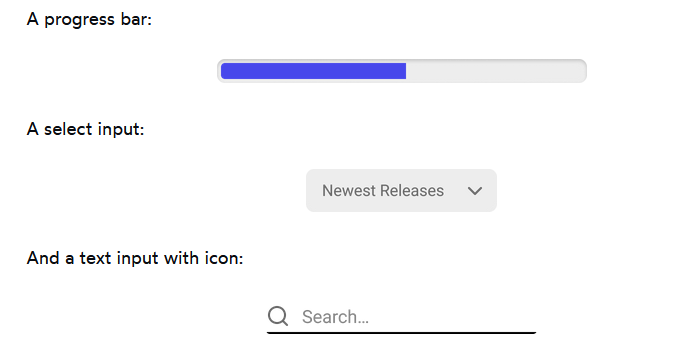
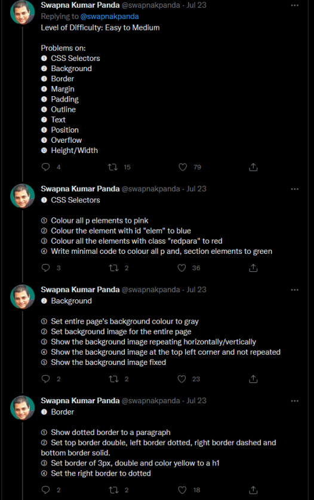

# Test your skills
- [Frontend Practice - Recreate the existing pages](https://www.frontendpractice.com/)
- [Chris Hansen - Master Frontend Development 💻 By Cloning These Websites 💯](https://www.dev.to/hyggedev/master-frontend-development-by-cloning-these-websites-1m08)
- [Lydia Hallie - JavaScript Questions with answers](https://github.com/lydiahallie/javascript-questions)
- [Frontend Mentor - improve your front-end skills by building different projects](https://www.frontendmentor.io/)
- [BFE.dev - prepare for Front-End job interviews](https://bigfrontend.dev/)
- [Wes Bos - JavaScript 30 - build 30 small projects/apps](https://javascript30.com/)
- [25 Extremely Modern Layouts Using CSS Grid✨ (try to recreate them!)](https://dev.to/preethi_dev/25-extremely-modern-layouts-using-css-grid-10ek)
- Exercises from [CSS for JavaScript Developers](https://css-for-js.dev/) - all modules:
  - [Huckleberry - the basics of CSS (flow layout, box model)](https://github.com/css-for-js/huckleberry)
  - [Character Creator - position and overflow](https://github.com/css-for-js/character-creator)
  - [Mini Component Library - create your own components (progress bar, select element and search input)](https://github.com/css-for-js/mini-component-library)

  <details>
    <summary>How these components could look like:</summary>

    

  </details>

  - [Sole and Ankle - Flexbox](https://github.com/css-for-js/sole-and-ankle)
  - [Sole and Ankle Revisited - responsive design](https://github.com/css-for-js/sole-and-ankle-revisited)
  - [Unsprinkle - typography and images](https://github.com/css-for-js/unsprinkle)
  
  <details>
    <summary>How this page looks like:</summary>

    

  </details>

  - [New Grid Times - CSS Grid Layout](https://github.com/css-for-js/new-grid-times)
    - [Design for this exercise](https://www.figma.com/file/BDdNhCeVLye5mFHHxQhkgE/New-Grid-Times?node-id=0%3A1)
  - [Sole and Ankle Animated - animations](https://github.com/css-for-js/sole-and-ankle-animated)

- [Florin Pop - App Ideas (from Beginners to Advanced)](https://github.com/florinpop17/app-ideas)
- [30 seconds of interviews - HTML, CSS, JavaScript, React, Node and Security questions & answers](https://30secondsofinterviews.org/)
- 🇵🇱 [Localhost Academy - Zbiór zadań HTML, CSS, JS, React, itp.](https://github.com/Przemocny/zbior-zadan-html-css-js-react)

<details>
<summary>Practice 50+ CSS Problems (taken from <a href="https://twitter.com/swapnakpanda/status/1550832649828122625">https://twitter.com/swapnakpanda/status/1550832649828122625</a>):</summary>




</details>

<details>
<summary>Real-world frontend technical questions:</summary>

### JavaScript
- How this expression is called?
```js
(function () {
  console.log('Hello!')  
})()
```
- What are the differences between JavaScript and other programming languages such as C++ and PHP?
- What are the key differences between ``var``, ``let`` and ``const``?
- How do you handle asynchronous requests in JavaScript?
- ``const`` vs ``Object.freeze`` - what are differences for arrays and objects?
- Based on this code:
```js
const obj = {nested: {}}

const anotherObj = {...obj}

obj.nested.a = 1
```
Does the ``a`` property will be declared also in ``anotherObj`` and why? If yes, how you can prevent it?

- How you can iterate through the objects?
- How you would describe hoisting?
- How you would describe array/object mutation? It is a good practice or something to avoid?
- Based on this code: 
```js
const result = (flag: boolean) => {
  return new Promise((resolve, reject) => {
    if (flag) {
      resolve('success');
    } else {
      reject('error');
    }
  })
}

const promise = result(true)

promise
  .then(r => {
    // 1.
    console.log(r)

    return result(false)
  })
  .catch(e => {
    // 2.
    console.log(e)

    return 'fail'
  })
  .then(r => {
    // 3.
    console.log(r)

    return result(true)
  })
  .catch(e => {
    // 4.
    console.log(e)
  })
```
What results will be displayed in console.log's and why?

- Based on this code: 
```js
const timeoutAsync = (time) => {
  return new Promise(resolve => {
    const timeout = setTimeout(() => {
      clearTimeout(timeout)
      resolve(`Timeout resolved after ${time} milliseconds.`);
    }, time);
  });
};

const timeouts = [timeoutAsync(9000), timeoutAsync(5500), timeoutAsync(1000)];

// 1.
timeouts.forEach(async (timeout) => {
  const info = await timeout;
  console.log(info);
})

// 2.
const timeoutsInfos = timeouts.reduce(async (promisedAcc, timeout) => {
  const acc = await promisedAcc;
  const info = await timeout;
  console.log(info);
  acc.push(info);
  return acc;
}, Promise.resolve([]))

// 3.
for await (const info of timeouts) {
  console.log(info);
}
```
What will be differences between those iterators? In which order the timeouts will be resolved and why?
- What are types of storages in browser?
- What will be result of ``{} === {}`` and why?
- Based on this code: 
```js
const arr = [7, 1, 4, 3, 2];

for (const elem of arr) {
  setTimeout(() => console.log(elem), elem);
}
```
In which order will be the logs displayed and why?

### TypeScript
- What are differences between ``type`` and ``interface``?
- How you can validate a data structure without using the third party validation library?
- Which access modifiers allow property to be accessible only within the class?

## React
- What is props?
- Why you have to use ``className`` attribute instead of ``class``?
- What will happen when a component in React component tree throws an error?
- What are the rules of the React Hooks?
- Given this following state:
```js
{
  id: 0,
  name: 'John',
  detailedInfo: {
    age: 30,
    address: '123 Main St',
  }
}
```
what is the correct way to increment the age?
- What is React Fragment and how they work?
- Given this code:
```js
const names = ['John', 'Jane', 'Mary', 'Bob']

function RandomName() {
  const [name, setName] = useState(name.at(0));
  const changeName = () => {
    const randomNameIndex = Math.floor(Math.random() * names.length);
    setName(names[randomNameIndex]);
  }

  return (
    <div>
      <p>Current name: {name}</p>
      <p>Previous name: {prevName}</p>
      <button onClick={changeName}>Change name</button>
    </div>
  );
}
``` 
How you can store the ``prevName`` value, so that it holds the previous value of ``name`` and is displayed properly in React?
- Which data structures cannot be rendered in React?
- What is ``React.memo`` and when you should use it?
- When do you use the ``useCallback`` hook and ``React.memo``?
- Which methods of class components is combined the ``useEffect`` hook?
- What hooks do you know and explain how do you use them?

## CSS
- What are the ways to center the container with two boxes?
- What is the difference between ``em`` and ``rem``?

### Other questions
- Do you know what is microfrontends? 
- Do you know any patterns from functional programming?
- Since I mentioned this paradigm, based on this code: 
```ts
import { interval, OperatorFunction } from 'rxjs';
import { take, map, filter } from 'rxjs/operators';

const curry: (n: number) => (num: number) => number = (n) => {
  return (num) => {
    return num * n
  }
}

const operator = (n: number): OperatorFunction<number, number> => {
  return map((number: number) => number * n);
}

const increaseByOne = (n: number): number => n + 1;

const number$ = interval(1000).pipe(map(increaseByOne));
const obser1$ = number$.pipe(take(3));
const obser2$ = number$.pipe(take(4), map((n: number): string => `Hello ${'!'.repeat(n - 1)}`));
const obser3$ = number$.pipe(take(5), map(curry(2)));
const obser4$ = number$.pipe(take(4), filter((n: number) => n !== 3), operator(10));

obser1$.subscribe((value: number) => {
  // 1.
  console.log(value);
});

obser2$.subscribe((value: string) => {
  // 2.
  console.log(value);
});

obser3$.subscribe((value: number) => {
  // 3.
  console.log(value);
});

obser4$.subscribe((value: number) => {
  // 4.
  console.log(value);
});
```
What values will be console.log'ed from observables and why?

- What do you think about testing, how are you doing it and what exactly you are testing?
- Can you mention a few design patterns and how you can apply them?
- Can you explain what is TDD, BDD and DDD? What are differences between them?
- What are types of methods in REST API?

</details>

<details>
<summary>Real-world frontend technical recruitment tasks</summary>

1. Internship recruitment task

- Create the function to calculate the balance in a specific category within the specified time period. 

```js
function getBalanceByCategoryInPeriod(transactionsList, category, startTime, endTime) {
  // ...
}
```

Parameters:
- transactionsList: array of transactions
- category: string
- start time: Date
- end time: Date

Transaction object looks like this:
```js
{
  id: 123,
  sourceAccount: 'my_account',
  targetAccount: 'coffee_shop',
  amount: -30,
  category: 'eating_out',
  time: '2018-03-12T12:34:00Z'
}
```

- Create the function to find duplicated transactions.

Sometimes when a customer gets charged, a duplicate transaction is created.
We need to find those transactions so that they can be dealt with. 
Everything about the transaction should be identical, except the transaction id and the time at which it occurred,
as there can be up to a minute delay.

```js
function findDuplicateTransactions(transactions) {
  // ...
}
```
Parameters: 
- transactions: array of transactions

Find all transactions that have the same sourceAccount, targetAccount, category, amount,
and the time difference between each consecutive transaction is less than 1 minute.

You can assume that all parameters will always be present and valid.
However, the incoming transactions are not guaranteed to be in any particular order.

List of all the duplicate transaction groups, ordered by time ascending (nested array of transactions).
The groups should be sorted in ascending order of the first transaction in the group.

Example:

Input:
```js
[
  {
    id: 3,
    sourceAccount: "A",
    targetAccount: "B",
    amount: 100,
    category: "eating_out",
    time: "2018-03-02T10:34:30.000Z",
  },
  {
    id: 1,
    sourceAccount: "A",
    targetAccount: "B",
    amount: 100,
    category: "eating_out",
    time: "2018-03-02T10:33:00.000Z",
  },
  {
    id: 6,
    sourceAccount: "A",
    targetAccount: "C",
    amount: 250,
    category: "other",
    time: "2018-03-02T10:33:05.000Z",
  },
  {
    id: 4,
    sourceAccount: "A",
    targetAccount: "B",
    amount: 100,
    category: "eating_out",
    time: "2018-03-02T10:36:00.000Z",
  },
  {
    id: 2,
    sourceAccount: "A",
    targetAccount: "B",
    amount: 100,
    category: "eating_out",
    time: "2018-03-02T10:33:50.000Z",
  },
  {
    id: 5,
    sourceAccount: "A",
    targetAccount: "C",
    amount: 250,
    category: "other",
    time: "2018-03-02T10:33:00.000Z",
  },
];
```

Output:
```js
[
  [
    {
      id: 1,
      sourceAccount: "A",
      targetAccount: "B",
      amount: 100,
      category: "eating_out",
      time: "2018-03-02T10:33:00.000Z",
    },
    {
      id: 2,
      sourceAccount: "A",
      targetAccount: "B",
      amount: 100,
      category: "eating_out",
      time: "2018-03-02T10:33:50.000Z",
    },
    {
      id: 3,
      sourceAccount: "A",
      targetAccount: "B",
      amount: 100,
      category: "eating_out",
      time: "2018-03-02T10:34:30.000Z",
    },
  ],
  [
    {
      id: 5,
      sourceAccount: "A",
      targetAccount: "C",
      amount: 250,
      category: "other",
      time: "2018-03-02T10:33:00.000Z",
    },
    {
      id: 6,
      sourceAccount: "A",
      targetAccount: "C",
      amount: 250,
      category: "other",
      time: "2018-03-02T10:33:05.000Z",
    },
  ],
];
```

2. Create e-commerce app using the included design (only for desktop).

Essentials:
- Has to use Gatsby.js (or any other SSG framework)
- Has to be pixel perfect.
- Use SCSS/SASS.
- Make the sliders animations (carousel).
- Recreate the hover effect.
- Upload it to GitHub.
- Use Bootstrap.
- App should be responsive.

Optional:
- Add the lightbox (create it yourself or use the NPM package), which opens, when clicked the image. Must have the option to move between the images (via the arrows).
- Add a bar under the slide that marks the countdown time until the next slide is shown. It is supposed to be animated, and when it reaches 100% it shows the next slide.
- Deploy the app on GitHub Pages / Netlify / Vercel / etc.
- Connect the WordPress to Gatsby and send the contact form data to it.
- Adding your own animations.
- Create a sub-page of the article, the content of which will be downloaded from wordpress. The look of this page is up to you, but put great emphasis on aesthetics.

Pay attention to the file structure.
Folders or components properly laid out. It will be an added advantage to pay attention to such elements as page loading speed, optimization of images, use of lazy loading, etc.

As a design you can use:
- https://dribbble.com/shots/15389208-Antic-Decoration-Landing-Page
- https://dribbble.com/shots/15182337-BoConcept-e-Commerce-Slider

3. GitHub Issues App

Essentials:
- Use GitHub API - either the REST API or GraphQL API.
- Use TypeScript.
- Take care of code quality and clean code.
- Use any JavaScript framework.

Features:
- App should search GitHub issues by username and repository name.
- App should have search bar, results list and number of results.
- On default it should display the default GitHub issues list response.
- While searching, the app should display the loading indicator.
- While searching, the result list should display the result of the search.
- It should search and display users and repositories together.
- The results should be sorted by ID.
- Pagination is optional.
- The app should be responsive.
- When the user is clicked, it should display in another view the username, nickname, followers count, following count, stars count and their avatar.
- When the repo is clicked, then nothing happens.

3. Yet another variation of GitHub Issues App.

Essentials:
- Use GitHub API - either the REST API or GraphQL API.
- Select any repo, which it should fetch the issues, ie. https://github.com/facebook/react
- You can use any third-party libraries.
- Take care of code quality and clean code.
- Use any architecture.
- App should be responsive.

Features:
- Load and display the last 10 issues.
- Implement the infinite scroll - when scrolled to the bottom, the app should fetch the next 5 issues.
- Each "tile" should have a title, issue number and creation date.
- When clicked, it should display the title, issue number, it's status (open/closed), creation date and it's body.
- It should also display the issue rate counter (like on Stack Overflow) and have to possibility to increse/decrease it.
- When the count is below ``-99`` or above ``99``, it should display ``99!!``, otherwise it should display the count.
- The count should be saved somewhere and still be available when the app is reloaded and the same issue will be open.

Optional:
- Local search engine.
- Animations and transitions.

4. Create the part of e-commerce app.

- Use this API: https://jsonplaceholder.typicode.com/photos
- Has to be pixel perfect.
- You can use Bootstrap, Material Design or any other component library.
- App should be responsive.
- TypeScript is recommended, but still optional.

Main page:
- Load and display all products.
- On navbar:
    - Search bar should filter the products by title.
    - Next to search bar it should have two checkboxes - active and promo, that are acting as filters.
    - Next to checkboxes it should have the Log In button - when clicked it should redirect to the login page.
- Working pagination in certain way:
    - When all pages are: n > 6
        - When user is on the first or second page:
            - 1,2,3 ... n-2, n-1, n
        - When user is on third page:
            - 2,3,4 ... n-2, n-1, n
    - When all pages are: n < 6
        - Present all pages like this:
            - 1,2,3,4,5,6
- Handle the situation, when it couldn't find the products.

Login page:
- The only login and password that is valid is "admin" and "admin123!".
- The "Forgot password" should do nothing.
- Handle the situation, when the login or password is incorrect.
- When the login is successful, it should redirect to the main page.
- The Log in button is changed to the avatar icon - when clicked, it should display the dropdown with the "Log out" option.
- When logout, the avatar icon is changed to the "Log in" button. 
- The log in should be persistant, even after the page is closed.

Optional:
- Write the unit tests.
- Write the e2e tests.

As a design you can use:
- https://dribbble.com/shots/15389208-Antic-Decoration-Landing-Page
- https://dribbble.com/shots/15117860-Syncrhomedics-Reference-Page
- https://dribbble.com/shots/16634976-eCommerce-Cosmetic-Web-design

5. Live-coding problem #1 - issue with too much rerendering of the same component (look at the console)
(you have to do something with memoization inside of the App component)
https://jsfiddle.net/mdh2c7xg/#

6. [Live-coding problem #2 - how to fetch user from the GitHub API?](https://jsfiddle.net/dn8rqksL/)


</details>
